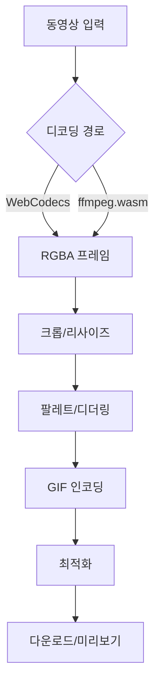

### 프로젝트 개요

오프라인(서버리스)으로 브라우저에서 동영상을 GIF로 변환·최적화하는 웹앱. 프런트엔드는 Vite + React, 연산 집약적인 GIF 처리(프레임 리사이즈·크롭·팔레트/디더링·인코딩·최적화)는 Rust를 WebAssembly(WASM)로 빌드해 클라이언트에서 수행한다. 동영상 디코딩은 WebCodecs를 우선 활용하고, 미지원 환경에는 ffmpeg.wasm으로 폴백한다.

### 목표와 핵심 가치

- 빠른 로컬 처리: 업로드 없이 개인정보 보호, 지연 최소화
- 간단하지만 강력한 편집: 크롭/리사이즈/프레임레이트/팔레트/디더링 옵션
- 결과 최적화: 시각 품질을 유지하면서 용량 최소화
- 범용 브라우저 호환과 안정성, 명확한 에러·진행률 피드백

### 범위 (V1)

- 동영상 → GIF 변환(입력: mp4/h264, webm/vp9 우선)
- 옵션: 해상도 리사이즈, 크롭(비율 잠금), 프레임레이트 조정, 루프, 배경/투명색
- 품질: 색상 수(최대 256), 팔레트 방식(글로벌/프레임별), 디더링(없음/FS/ordered)
- 최적화: 중복 프레임 제거, 단순 프레임 간소화, 기본 LZW 튜닝
- UI: 드래그앤드롭/파일선택, 미리보기, 기본 타임라인, 단계별 진행률, 취소
- 출력: 로컬 다운로드, 결과 메타(프레임 수/용량/설정) 표시

### 비기능 요구사항

- 성능: 720p 10초 클립을 기본 설정으로 10초 내 처리(데스크톱 기준)
- 메모리: 1GB 내에서 안정 동작(대용량 입력은 스트리밍·청크 처리)
- 보안/프라이버시: 완전 로컬 처리, 네트워크 전송 없음
- 접근성: 키보드 내비게이션, 명도 대비, 라이브 영역(progress) 지원
- 국제화: 최소 ko/en 구조 준비

### 아키텍처 개요

- React(Vite, TypeScript) UI 레이어
- Web Worker에서 Rust WASM 모듈 실행(메인 스레드 비점유)
- 동영상 디코딩 경로
  - 기본: `WebCodecs`로 프레임 추출 → `OffscreenCanvas`로 RGBA 버퍼 획득
  - 폴백: `ffmpeg.wasm`으로 프레임 디코드 → RGBA 버퍼 획득
- 프레임 처리 파이프라인
  1) (옵션) 크롭/리사이즈(Canvas 또는 WASM)
  2) 팔레트 생성(글로벌 우선)·디더링
  3) GIF 인코딩(LZW)
  4) (옵션) 후처리 최적화(중복 프레임 제거/지속시간 조정)
- 결과는 Blob(`image/gif`)으로 반환하여 다운로드

### 기술 스택 및 주요 결정

- 프런트엔드: `Vite`, `React`, `TypeScript`
- WASM: `Rust`, `wasm-bindgen`, `wasm-pack`(target: web), 선택적으로 `wasm-opt`
- 디코딩: 우선 `WebCodecs`, 폴백으로 `ffmpeg.wasm`
- 리사이즈: 초기엔 Canvas(`OffscreenCanvas`), 필요 시 Rust `fast_image_resize` 도입
- 팔레트/디더링: Rust `image`/`color_quant` 기반(글로벌 팔레트 우선), FS/ordered 선택
- 워커: `Web Worker` + transferable(또는 `SharedArrayBuffer`), 가능 시 cross-origin isolation

### 브라우저 지원

- 데스크톱: Chrome 109+, Edge 109+, Firefox 최신, Safari 16+
- 모바일: Android Chrome 최신(기본 지원), iOS Safari 16+(제한적: WebCodecs/Worker 제약 고려)
- WebCodecs 미지원: 자동 폴백(ffmpeg.wasm), 기능 축소 고지

### 보안/프라이버시

- 완전 로컬 처리·네트워크 전송 없음
- 필요 시 cross-origin isolation 헤더 설정(COOP/COEP)로 `SharedArrayBuffer`/SIMD 활성
- CSP 기본값: 스크립트·워커·WASM self만 허용

### 파일 처리 및 메모리 전략

- 큰 입력은 프레임 단위 스트리밍 처리로 피크 메모리 절감
- RGBA 버퍼는 transferable로 이동(복사 최소화)
- 글로벌 팔레트는 샘플링 기반으로 계산(전 프레임 스캔 방지)
- 진행률·취소: 워커에서 단계별 이벤트(postMessage)

### 공개 API(초안, WASM 바인딩)

- `init(options)`: 초기화, SIMD/threads 사용 가능 여부 결정
- `encode_gif(frames, options) -> Uint8Array`
  - frames: `{ data: Uint8Array, width: number, height: number, durationMs: number }[]`
  - options: `{ width?, height?, crop?, fps?, colors: 2..256, dither: 'none'|'fs'|'ordered', loop: number }`
- `optimize_gif(input: Uint8Array, options) -> Uint8Array`
- 에러는 명시적 코드/메시지로 반환

### UI/UX 사양(요약)

- 업로드/드래그앤드롭, 썸네일, 타임라인(인/아웃 포인트)
- 크롭: 비율 잠금(1:1, 4:3, 16:9, 자유), 스냅, 키보드 조작
- 리사이즈: 픽셀·퍼센트, 보간(자동/고품질)
- 프리셋: Discord/Slack/Twitter 최적값(해상도/프레임레이트/색상수)
- 진행률: 디코드/리사이즈/팔레트/인코드/최적화 단계별, 취소/일시중지/재시작

### 성능/품질 기준(초안)

- 시간 예산: 720p 10s → 기본 설정 10s 내
- 메모리: < 1GB 피크, 프레임 버퍼 재사용
- 결과 용량: 기준 H.264 10s 720p → GIF 8MB 이하(기본 설정 가이드)
- 시각 품질: 사용자 주관 평가 + 선택 샘플 SSIM-like 참고 지표

### 에러 처리/복구

- 코덱 미지원/브라우저 제약 감지 → 가이드 모달
- 큰 파일 OOM 위험 → 해상도/프레임레이트 자동 하향 제안
- 폴백(FFmpeg) 경고 및 처리 시간 증가 고지

### 빌드/배포

- Rust: `wasm-pack build --target web` → `pkg/` 산출 → Vite에서 import
- Vite: 코드 스플리팅, 워커 번들(rollup worker), `.wasm` asset 핸들링
- 최적화: `wasm-opt -Oz`, source map 분리
- 정적 배포: Cloudflare Pages/GitHub Pages. 필요 시 COOP/COEP 헤더 설정

### 테스트/QA

- 샘플 클립 세트(짧음/중간/길음, 다양한 코덱/해상도)
- 회귀: 동일 입력·옵션에 대해 GIF 바이트 크기·프레임 수·메타 동일성 확인
- 브라우저 매트릭스 수동 체크리스트 + 자동 스모크(워커 로드/간단 변환)
- 퍼포먼스 벤치마크 스크립트(프레임 수·시간·메모리 로깅)

### 로드맵

- M1: 프로젝트 세팅(Vite/React/TS), 워커/wasm-pack 통합, 기본 WebCodecs 디코딩, 단일 프레임 인코딩 POC
- M2: 프레임 파이프라인(리사이즈/크롭), 글로벌 팔레트, 기본 디더링, 진행률/취소
- M3: 최적화(중복 프레임 제거), 프리셋, 다운로드 UX, 에러 처리 강화
- M4: ffmpeg.wasm 폴백, PWA(오프라인), 접근성/국제화 개선
- M5: 벤치마크/회귀셋 확장, 브라우저 호환 최적화, 문서화

### 오픈 이슈/결정 포인트

- WebCodecs 비지원 환경의 최소 기능 정의(리사이즈/크롭만? 처리 시간 경고?)
- 글로벌 vs 프레임별 팔레트 기본값(성능/품질 트레이드오프)
- 리사이즈를 Canvas로 유지 vs Rust로 이전 기준(퀄리티/속도/이식성)
- COOP/COEP 적용으로 cross-origin isolation 확보 여부(호스팅 제약)
- 모바일(iOS)에서의 제한(워커 성능·메모리)과 UX 가드레일

### 라이선스/법적 고려

- ffmpeg.wasm 사용 시 관련 라이선스 고지 포함
- 특허 코덱(HEVC 등) 입력은 폴백 경고 및 비보장 명시
- 프로젝트 라이선스(예: MIT) 및 서드파티 NOTICE 유지

### 성공 기준(요약)

- 720p 10s 샘플을 기본 설정으로 10초 내 변환, 결과 8MB±2MB
- 크롬·파이어폭스·사파리 최신에서 정상 동작(폴백 포함)
- 사용자 테스트(5명)에서 기본 플로우 무리 없이 완료

